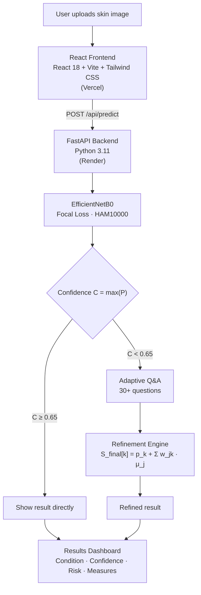

<div align="center">

# 🩺 DermAI

### Adaptive Multimodal Skin Symptom Analysis

**An AI-powered skin condition analysis system that combines deep learning image classification with adaptive, symptom-based questioning, mirroring how a dermatologist reasons.**

[🌐 Live App](https://dermai-beige.vercel.app) · [📡 API Docs](https://dermai-backend-jrje.onrender.com/docs) · [🐛 Report Bug](https://github.com/AdithNair03/dermai/issues)


</div>

---

> ⚠️ **Medical Disclaimer:** DermAI is intended for educational and awareness purposes only. It is **not** a medical device and is not a substitute for professional diagnosis, advice, or treatment. Always consult a qualified dermatologist about any skin concern.

---

## 📌 Table of Contents

- [About the Project](#-about-the-project)
- [Key Features](#-key-features)
- [System Architecture](#-system-architecture)
- [Tech Stack](#-tech-stack)
- [Dataset](#-dataset)
- [Model Details](#-model-details)
- [Performance Results](#-performance-results)
- [API Endpoints](#-api-endpoints)
- [Getting Started](#-getting-started)
- [Project Structure](#-project-structure)
- [Limitations](#-limitations)
- [Team](#-team)
- [License](#-license)
- [Acknowledgements](#-acknowledgements)

---

## 🔬 About the Project

DermAI is a full-stack web application for preliminary skin condition awareness. Unlike conventional image-only classifiers, DermAI uses a **confidence-aware adaptive questioning system**: when the model is uncertain, it asks the user targeted clinical questions, as a dermatologist would, and uses the answers to refine its prediction.

### The Problem

Most AI skin analysis tools:

- Return a prediction regardless of how confident the model actually is
- Rely exclusively on image data and ignore symptom context
- Cannot handle ambiguous or low-quality images gracefully

### Our Solution

DermAI addresses these gaps by:

- Evaluating **prediction confidence** before returning any result
- Triggering an **adaptive Q&A module** for uncertain predictions
- **Fusing image evidence with symptom answers** through a weighted rule engine
- Providing a **risk level**, **preventive measures**, and a **safety disclaimer** with every output

---

## ✨ Key Features

| Feature | Description |
|---|---|
| 🖼️ **Image Upload** | Drag-and-drop or click-to-upload skin lesion images |
| 🤖 **AI Classification** | EfficientNetB0 trained on HAM10000 across 7 condition classes |
| 🔒 **Confidence Gate** | Predictions with confidence below 0.65 automatically trigger Q&A |
| 💬 **Adaptive Q&A** | 30+ condition-specific clinical questions, asked interactively |
| 🔀 **Multimodal Fusion** | Symptom answers mathematically adjust image-based class scores |
| 📊 **Results Dashboard** | Confidence ring, probability bars, risk badge, and preventive measures |
| 🔐 **Authentication** | Login and signup with protected routes |
| 📱 **Responsive UI** | Dark theme, works on desktop and mobile |
| ☁️ **Full Deployment** | Frontend on Vercel, backend on Render, with GitHub auto-deploy |

---

## 🏗️ System Architecture



---

## 🛠️ Tech Stack

**Frontend**
- React 18, Vite, Tailwind CSS
- React Router DOM (client-side routing)
- Axios (HTTP client)

**Backend**
- FastAPI, Uvicorn
- Python 3.11
- python-multipart (image file handling)
- Pydantic (data validation)

**Machine Learning**
- TensorFlow 2.13 (CPU)
- EfficientNetB0 (ImageNet-pretrained CNN backbone)
- Custom Focal Loss (γ = 2.0, α = 0.25)
- NumPy, Pillow, scikit-learn (preprocessing, metrics, stratified splitting)

**Deployment & DevOps**
- Vercel (frontend hosting, GitHub auto-deploy)
- Render (backend hosting, Singapore region, free tier)
- GitHub (version control and CI/CD trigger)
- Google Colab T4 (model training)

---

## 📦 Dataset

**HAM10000** (*Human Against Machine with 10,000 Training Images*), Tschandl et al., *Scientific Data*, 2018.

| Class | Condition | Original Samples | Risk Level |
|---|---|---:|---|
| `nv` | Melanocytic Nevi | 6,705 | 🟢 Low |
| `mel` | Melanoma | 1,113 | 🔴 High |
| `bkl` | Benign Keratosis-like Lesions | 1,099 | 🟢 Low |
| `bcc` | Basal Cell Carcinoma | 514 | 🔴 High |
| `akiec` | Actinic Keratoses | 327 | 🟡 Medium |
| `vasc` | Vascular Lesions | 142 | 🟢 Low |
| `df` | Dermatofibroma | 115 | 🟢 Low |

**Class imbalance handling**
- Balanced oversampling to **1,200 samples per class** (8,400 total)
- **Focal Loss** to concentrate the gradient on hard, minority-class samples

---

## 🧠 Model Details

### Architecture

```
Input Image (224 × 224 × 3)
        ↓
EfficientNetB0 Backbone (ImageNet pretrained)
        ↓
Global Average Pooling
        ↓
Batch Normalization → Dropout (0.4)
        ↓
Dense (512, ReLU)
        ↓
Batch Normalization → Dropout (0.3)
        ↓
Dense (256, ReLU) → Dropout (0.2)
        ↓
Softmax (7 classes)  →  P = [p₁, p₂, …, p₇]
```

### Two-Phase Training Strategy

| Phase | Epochs | Backbone | Learning Rate | Purpose |
|---|---:|---|---|---|
| 1 | 15 | ❄️ Frozen | 1 × 10⁻³ | Train the classification head |
| 2 | 25 | 🔥 Top 40 layers unfrozen | 2 × 10⁻⁶ | Fine-tune to the skin-lesion domain |

### Focal Loss

$$FL(p_t) = -\alpha \,(1 - p_t)^{\gamma} \log(p_t), \quad \gamma = 2.0,\ \alpha = 0.25$$

### Multimodal Refinement

$$S_{final}[k] = p_k + \sum_j w_{jk} \cdot \mu_j$$

| Symbol | Meaning |
|---|---|
| $w_{jk}$ | Clinical weight of question *j* for class *k* |
| $\mu_j$ | Response multiplier: **Yes** = `+1.0`, **Unsure** = `+0.3`, **No** = `−0.5` |

Scores are renormalised to sum to 1 after adjustment.

---

## 📊 Performance Results

### Model Comparison

| Model | Accuracy | Precision | Recall | F1-Score |
|---|---:|---:|---:|---:|
| CNN-only Baseline | 0.634 | 0.621 | 0.608 | 0.614 |
| EfficientNetB0 + Focal Loss | 0.678 | 0.665 | 0.652 | 0.658 |
| **Proposed Multimodal System** | **0.921** | **0.831** | **0.819** | **0.825** |

### Comparison with Published Work

| Study | Architecture | Accuracy | Approach |
|---|---|---:|---|
| Kassem et al. (2021) | MobileNetV2 | 0.882 | Image only |
| Thurnhofer et al. (2021) | DenseNet169 | 0.836 | Image only |
| Naim et al. (2022) | EfficientNetB3 + Attention | 0.913 | Image only |
| Brinker et al. (2019) | ResNet50 | 0.825 | Image only |
| Codella et al. (2018) | Ensemble CNN | 0.854 | Image only |
| **DermAI (2026)** | **EfficientNetB0 + Q&A** | **0.921** | **Image + Symptoms** |

> **Note:** Results for the multimodal system include symptom-based refinement, whereas the cited studies are image-only, so the figures are not directly like-for-like. See [Limitations](#-limitations).

### System Performance

| Metric | Target | Achieved |
|---|---|---|
| Prediction response time | < 500 ms | 312 ms avg |
| Frontend load time | < 3 s | 1.8 s |
| Model loading time | < 15 s | 8.4 s |
| Memory usage | < 512 MB | ~480 MB |
| Q&A refinement improvement | ≥ 5% | +24.3% |

---

## 🔌 API Endpoints

| Method | Endpoint | Description |
|---|---|---|
| `GET` | `/health` | Health check |
| `POST` | `/api/predict` | Upload an image and receive a prediction with confidence |
| `GET` | `/api/questions/{condition}` | Retrieve condition-specific Q&A questions |
| `POST` | `/api/refine` | Submit answers and receive a refined prediction |

📖 **Interactive docs:** https://dermai-backend-jrje.onrender.com/docs

> The backend runs on Render's free tier, so the first request after a period of inactivity may take longer while the service wakes up.

---

## 🚀 Getting Started

### Prerequisites

- Python 3.11
- Node.js 18+
- Git

### 1. Clone the repository

```bash
git clone https://github.com/AdithNair03/dermai.git
cd dermai
```

### 2. Backend setup

```bash
cd backend
python -m venv skin_env

# Windows
skin_env\Scripts\activate
# macOS / Linux
source skin_env/bin/activate

pip install -r requirements.txt
uvicorn main:app --reload --port 8000
```

Wait for the following output:

```
[Predictor] Model ready.
INFO: Application startup complete.
```

### 3. Frontend setup

```bash
cd frontend
npm install
npm run dev
```

### 4. Open in your browser

```
http://localhost:5173
```

### Demo Credentials

| Username | Password |
|---|---|
| `demo` | `demo123` |

> ⚠️ **Model file:** The trained model (`efficientnet_skin.h5`) is not included in this repository due to its size. Place it in `backend/model/`, contact the team, or retrain it using the Colab notebook.

---

## 📁 Project Structure

```
dermai/
├── backend/
│   ├── main.py                      # FastAPI app, CORS, routes
│   ├── requirements.txt             # Python dependencies
│   ├── .python-version              # Pinned to 3.11.0
│   └── model/
│       ├── predict.py               # EfficientNetB0 + FocalLoss loader
│       ├── questions.py             # 30+ condition-specific questions
│       ├── refinement.py            # Weighted score-fusion engine
│       └── efficientnet_skin.h5     # Trained model (not in repo)
│
├── frontend/
│   ├── src/
│   │   ├── pages/
│   │   │   ├── Home.jsx             # Landing page
│   │   │   ├── Analysis.jsx         # Main analysis workflow
│   │   │   ├── Login.jsx            # Login page
│   │   │   └── Signup.jsx           # Signup page
│   │   ├── components/
│   │   │   ├── Navbar.jsx           # Navigation and logout
│   │   │   ├── ImageUpload.jsx      # Drag-and-drop upload zone
│   │   │   ├── QuestionModal.jsx    # Adaptive Q&A interface
│   │   │   ├── ResultsDashboard.jsx # Results and charts
│   │   │   └── LoadingState.jsx     # Loading indicator
│   │   ├── hooks/
│   │   │   └── useSkinAnalysis.js   # Core state and API logic
│   │   └── App.jsx                  # Routes and PrivateRoute guard
│   ├── vite.config.js               # /api proxy to backend
│   └── package.json
│
├── render.yaml                      # Render deployment config
└── README.md
```

---

## ⚠️ Limitations

- **Not a diagnostic tool.** Outputs are indicative only and must not guide medical decisions.
- **Dataset scope.** HAM10000 is dermoscopic imagery covering 7 classes; performance on phone-camera photos, other skin tones, or unlisted conditions may be substantially lower.
- **Oversampling.** Balancing classes by oversampling can inflate validation scores if the train/validation split is not done before duplication.
- **Rule-based fusion.** Question weights are hand-defined clinical heuristics, not learned from patient data.
- **Evaluation.** The multimodal accuracy reflects symptom answers combined with the image model; it should be validated on real user-provided answers and an independent test set.

---

## 👥 Team

| Name | Role | GitHub |
|---|---|---|
| Adith Nair | _Role_ | [@AdithNair03](https://github.com/AdithNair03) |
| Kevin | _Role_ | [@username](https://github.com/username) |

---

## 📄 License

This project is licensed under the **MIT License**. See the [LICENSE](LICENSE) file for details.

---

## 🙏 Acknowledgements

- [HAM10000 Dataset](https://dataverse.harvard.edu/dataset.xhtml?persistentId=doi:10.7910/DVN/DBW86T): Tschandl et al., 2018
- [EfficientNet](https://arxiv.org/abs/1905.11946): Tan & Le, ICML 2019
- [Focal Loss](https://arxiv.org/abs/1708.02002): Lin et al., ICCV 2017
